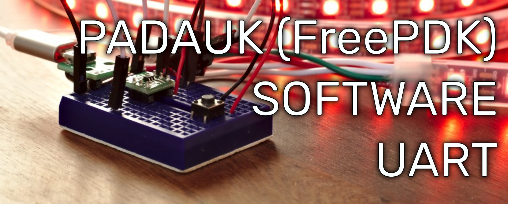

+++
title = "FreePDK UART Software UART Generator"
date = 2020-09-12

[taxonomies]
categories = ["Apps"]
tags = ["Padauk", "Hardware"]
+++

This article contains new software UART generation utility for Padauk MCU's. UART code is written mostly in the Assembly, and this should give pretty significant UART baud's while providing quite stable behavior.

<!-- more -->

{{ app_freepdk_uart_gen() }}