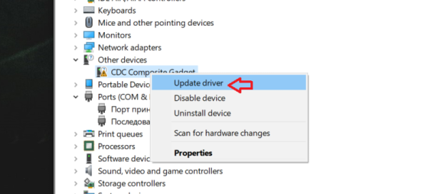
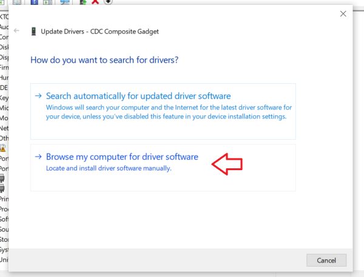
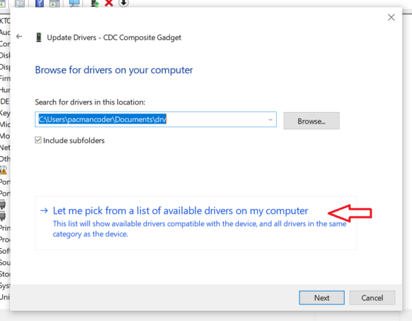
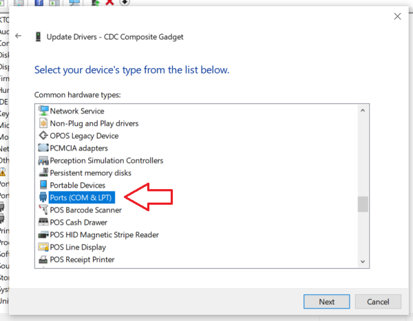
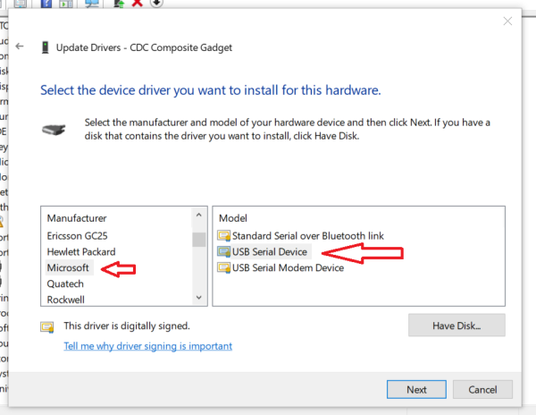
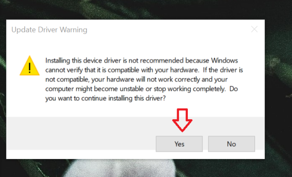

+++
title = "Using default Windows driver for USB CDC devices"
date = 2020-09-12

[taxonomies]
categories = ["How to"]
tags = ["Windows", "Drivers"]
+++

Recently I have moved from Linux to Windows OS as my daily driver and I needed to connect to my
PocketCHIP via its built-in USB CDC mode. But I am instantly stumbled upon the issue: even this
USB-to-serial is a pretty normal USB CDC class device, Windows was not able to install
drivers automatically.

Usually, device vendors provide their own signed device drivers, but it is usually a big pain in the
backside to find the special driver for each CDC device. So I was almost ready for a whole lot
of pain during the driver search, but then I thought - "Hey, it is 2020 already, maybe Windows
could offer something simpler?"

<!-- more -->

### How about usbser.sys?
It is turned out that Windows already has a default USB-to-serial driver starting form Windows
8.1 - *usbser.sys*, which is just needed to be selected manually for the device, as Windows does not
select it automatically! So, here instruction how to use it (**WARNING: I am not liable for any
damage to your hardware/OS, you are doing this on your own risk!**):

1. Select the device in the device manager, press the right button and then press "Update driver"

1. Press "Browse my computer for driver software"

1. Select "Let me pick from a list of available drivers on my computer"

1. Search for "Ports (COM & LPT) in the list and select it

1. Select "Microsoft" in the left list and "USB Serial Device" in the right list

1. Press "Yes" on the appeared warning

1. You are ready to rock! 