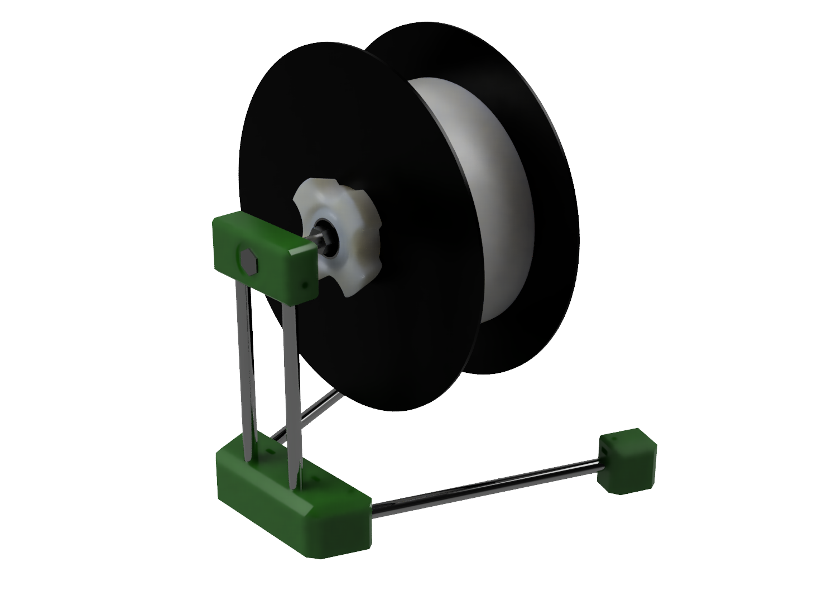

+++
title = "Universal tabletop spool holder"
date = 2021-01-04

[taxonomies]
categories = ["3D printing"]
tags = ["3D model"]
+++

I made a simple tabletop filament spool holder, based on
the [QCUSH](https://www.thingiverse.com/thing:1241566). Take a look at Thingiverse:
[thing:4709406](https://www.thingiverse.com/thing:4709406)
<!-- more -->
*Video:*
{{ youtube(id="CjRTTAGys1g", class="youtube") }}